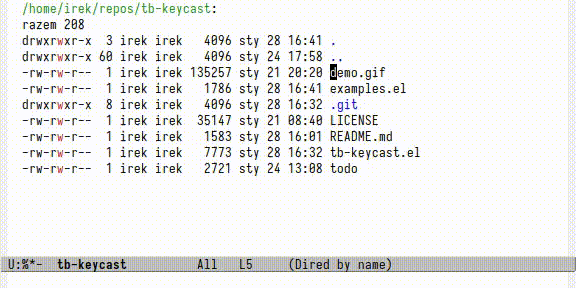

# Emacs Tab Bar Keycast

Emacs global minor mode that shows in tab-bar-mode line last pressed
key with corresponding function name and how many times was repeated.
It ignores regular typing, mouse drag, minibuffer commands not
executed by pressing keys and other random undefined bindings.



## Requirements

Variable `tab-bar-format` introduced in Emacs 28.1 is required.

## Installation

Get `tb-keycast.el` file.

```shell
# You can clone entire repo
git clone git@github.com:ir33k/tb-keycast.git

# Or just get the file with one of those:
wget    https://raw.githubusercontent.com/ir33k/tb-keycast/master/tb-keycast.el
curl -O https://raw.githubusercontent.com/ir33k/tb-keycast/master/tb-keycast.el
```

Use `M-x load-file<RET>path_to/tb-keycast.el<RET>` or load with code:

```elisp
;; Put tb-keycast.el file to one of `load-path' directories or add new
;; path to tb-keycast.el to `load-path' list so Emacs know how to find
;; tb-keycast library.
(add-to-list 'load-path "~/path_to_file")

;; Load with require or type: M-x load-library<RET>tb-keycast<RET>.
(require 'tb-keycast)
```

## Usage

Toggle with `M-x tb-keycast-mode`.


## Note

Tested only on Emacs 29.0.
