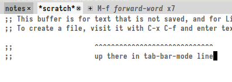

# Emacs Tab Bar Keycast

Emacs global minor mode that shows in tab-bar-mode line last pressed
key with corresponding function name and how many times was repeated.
It ignores regular typing, mouse drag, minibuffer commands not
executed by pressing keys and other random undefined bindings.

## Requirements

**Emacs version 28.1 or higher is required**.

You need to have `tab-bar-format` variable.
